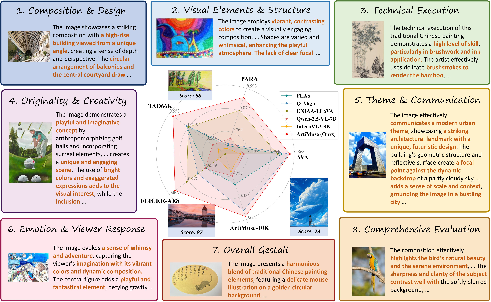

<h1 style="line-height: 1.4;">
  <span style="color: #FF3E3E;">A</span><span style="color: #FF914D;">r</span><span 
  style="color: #FFC94D;">t</span><span style="color: #B6E24D;">i</span><span
  style="color: #4DDC95;">M</span><span style="color: #4DB8FF;">u</span><span
  style="color: #8564FF;">s</span><span style="color: #C74DFF;">e</span>:
  Fine-Grained Image Aesthetics Assessment with Joint Scoring and Expert-Level Understanding
</h1>


<h1 style="margin-top: -10px; color: #666; font-weight: normal; font-size: 20px;">
  书生 · 妙析多模态美学理解大模型
</h1>

[👉 Try the Online Demo Now](http://artimuse.intern-ai.org.cn/)


> 🔬 **We are actively developing an enhanced version of ArtiMuse with reasoning capabilities — _ArtiMuse-R1_.**  
> 🌟 Stay tuned for exciting updates and improvements!


**Shuo Cao**, **Nan Ma**, **Jiayang Li**, **Xiaohui Li**, **Lihao Shao**, **Kaiwen Zhu**, **Yu Zhou**, **Yuandong Pu**, **Jiarui Wu**, **Jiaquan Wang**, **Bo Qu**, **Wenhai Wang**, **Yu Qiao**, **Dajuin Yao†**, **Yihao Liu†**

† Corresponding Authors

## [📄 **Paper**](https://arxiv.org/abs/2507.14533) | [🌐 **Project Page**](https://thunderbolt215.github.io/ArtiMuse-project/) | [📁 **Dataset**](#)





## 📰 News & Updates

- 🚀 **July 24, 2025**  
  The **Online Demo** is now open for public access!

- 🚀 **July 21, 2025**  
  The **Paper**, **Repository** and **Project Page** are now live!


## 🔍 Abstract

The rapid advancement of educational applications, artistic creation, and AI-generated content (AIGC) technologies has substantially increased practical requirements for comprehensive Image Aesthetics Assessment (IAA), particularly demanding methods capable of delivering both quantitative scoring and professional understanding.  
 
In this paper, we present:  
**(1) ArtiMuse**, an innovative MLLM-based IAA model with Joint Scoring and Expert-Level Understanding capabilities;  
**(2) ArtiMuse-10K**, the first expert-curated image aesthetic dataset comprising 10,000 images spanning 5 main categories and 15 subcategories, each annotated by professional experts with 8-dimensional attributes analysis and a holistic score.  


## ✅ TODO

* [ ] ArtiMuse-10K dataset
* [ ] Checkpoints of ArtiMuse
* [ ] Training and evaluation code for ArtiMuse
* [ ] 🧠 ArtiMuse-R1 (reasoning-enabled version)


## 🙏 Acknowledgements

Our work is built upon the [InternVL-3](https://github.com/OpenGVLab/InternVL) model as the base foundation. We also refer to the implementation of [Q-Align](https://github.com/Q-Future/Q-Align) during development. We sincerely thank the authors of both projects for their excellent contributions to the community.


## ✒️ Citation

If you find this work useful, please consider citing:

```bibtex
@misc{cao2025artimusefinegrainedimageaesthetics,
      title={ArtiMuse: Fine-Grained Image Aesthetics Assessment with Joint Scoring and Expert-Level Understanding}, 
      author={Shuo Cao and Nan Ma and Jiayang Li and Xiaohui Li and Lihao Shao and Kaiwen Zhu and Yu Zhou and Yuandong Pu and Jiarui Wu and Jiaquan Wang and Bo Qu and Wenhai Wang and Yu Qiao and Dajuin Yao and Yihao Liu},
      year={2025},
      eprint={2507.14533},
      archivePrefix={arXiv},
      primaryClass={cs.CV},
      url={https://arxiv.org/abs/2507.14533}, 
}
```
